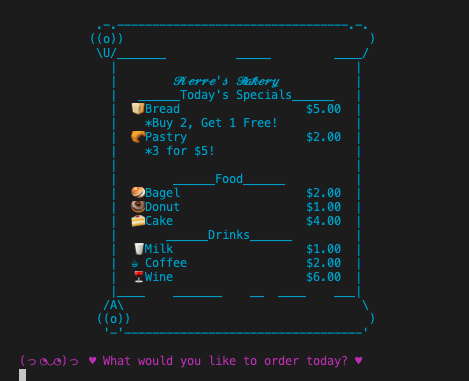

# _Pierre's Bakery_

#### _A C# Console Application to take orders at a bakery, February 2020_

#### By _**K. Wicz**_


## Preview




## Description

_Welcome to Pierre's Bakery, where the food is fresh and the deals are plentiful!  This application allows users to order items off of Pierre's Bakery's menu.  At the end of a user's order, the items and total cost are compiled into an easy-to-read reciept for the user._

## Behavior Driven Project Specifications

| Behavior | Input | Output |
|:---|:---:|:---:|
|User orders a menu item|1 Bagel|Order total increases by $2.00|
|User enters a single item of the daily deal|1 Bread|Order total increases by $5.00|
|User selects enough sale items to qualify for a deal|3 Breads|Order total increases by $10|

## Setup/Installation Requirements

In your computer's terminal:

1. Navigate to where you want this application to be saved, i.e.:
```sh
cd desktop
```
2. Clone the file from GitHub with HTTPS
```sh
git clone https://github.com/kwicz/pierres-bakery.git
```
3.  Enter into the new file directory
```sh
cd pierres-bakery
```
4.  Start the program
```sh
dotnet run
```

## Known Bugs

_No known bugs at this time._

## Support and contact details

_Have a bug or an issue with this application? [Open a new issue](https://github.com/kwicz/pierres-bakery/issues) here on GitHub._

## Technologies Used

* C#
* .NET Core
* ASCII Art

### License

[MIT](https://choosealicense.com/licenses/mit/)

Copyright (c) 2020 **_K.Wicz_**